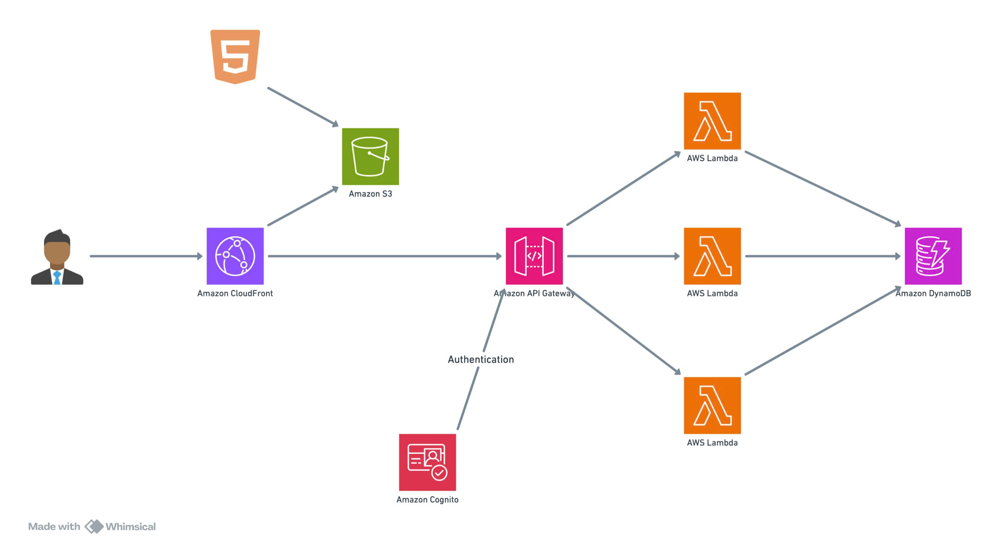

# E-Commerce Serverless Application

A full-stack serverless e-commerce application built with AWS cloud services, featuring a modern React frontend and scalable serverless backend architecture.

## 🏗️ Architecture



This project implements a complete serverless e-commerce solution using AWS cloud services:

- **Frontend**: Next.js with Tailwind CSS deployed on S3 and CloudFront
- **Backend**: Node.js Lambda functions with API Gateway
- **Database**: DynamoDB for product, user, and order data
- **Authentication**: AWS Cognito for user management
- **Infrastructure**: CloudFormation templates for Infrastructure as Code
- **CI/CD**: CodePipeline for automated deployments

## ✨ Features

### Core E-Commerce Functionality
- **Product Browsing**: Browse and search through product catalog
- **Shopping Cart**: Add products to cart and manage quantities
- **User Authentication**: Secure login/registration with AWS Cognito
- **Order Management**: Place orders and view order history
- **Responsive Design**: Modern UI built with Radix UI components

### Technical Features
- **Serverless Architecture**: Fully serverless with automatic scaling
- **RESTful API**: Clean API design with proper HTTP methods
- **CORS Support**: Cross-origin resource sharing configuration
- **Security**: JWT-based authentication with Cognito
- **Infrastructure as Code**: CloudFormation templates for reproducible deployments

## 🛠️ Technology Stack

### Frontend
- **Framework**: Next.js 15 with React 19
- **Styling**: Tailwind CSS with Radix UI components
- **State Management**: React Context API
- **Authentication**: AWS Amplify with Cognito integration
- **Build Tool**: Next.js with TypeScript support

### Backend
- **Runtime**: Node.js 18.x
- **Functions**: AWS Lambda with SAM framework
- **API**: API Gateway with CORS configuration
- **Database**: DynamoDB with GSI support
- **Authentication**: AWS Cognito User Pools

### Infrastructure
- **IaC**: AWS CloudFormation/SAM templates
- **CI/CD**: AWS CodePipeline
- **CDN**: CloudFront for global content delivery
- **Storage**: S3 for static website hosting

## 📁 Project Structure

```
e-commerce-serverless/
├── serverless/
│   ├── serverless-frontend/          # Next.js frontend application
│   │   ├── app/                      # Next.js app directory
│   │   ├── components/               # Reusable React components
│   │   ├── context/                  # React context providers
│   │   ├── hooks/                    # Custom React hooks
│   │   ├── lib/                      # Utility libraries
│   │   ├── public/                   # Static assets
│   │   ├── styles/                   # CSS styles
│   │   └── template.yaml             # SAM template for frontend
│   └── serverless-backend/           # Node.js Lambda backend
│       ├── src/
│       │   ├── functions/
│       │   │   ├── products/         # Product-related Lambda functions
│       │   │   ├── orders/           # Order-related Lambda functions
│       │   │   └── users/            # User-related Lambda functions
│       │   └── utils/                # Shared utilities
│       └── template.yaml             # SAM template for backend
├── cloudformation/                   # Infrastructure templates
│   ├── cloudformations-backend/     # Backend infrastructure
│   └── cloudformations-frontend/    # Frontend infrastructure
├── screenshots/                      # Application screenshots and docs
└── project.txt                      # Project requirements
```

## 🚀 Quick Start

### Prerequisites

- Node.js 18+ and npm/pnpm
- AWS CLI configured with appropriate permissions
- AWS SAM CLI installed
- Git

### Backend Deployment

1. **Navigate to backend directory**:
   ```bash
   cd serverless/serverless-backend
   ```

2. **Install dependencies**:
   ```bash
   npm install
   ```

3. **Deploy using SAM**:
   ```bash
   sam build
   sam deploy --guided
   ```

4. **Note the API Gateway URL** from the deployment output for frontend configuration.

### Frontend Deployment

1. **Navigate to frontend directory**:
   ```bash
   cd serverless/serverless-frontend
   ```

2. **Install dependencies**:
   ```bash
   npm install
   # or
   pnpm install
   ```

3. **Configure environment variables**:
   Create necessary environment files with your AWS resources URLs.

4. **Build and deploy**:
   ```bash
   npm run build
   sam build
   sam deploy --guided
   ```

### Local Development

#### Backend
```bash
cd serverless/serverless-backend
sam local start-api
```

#### Frontend
```bash
cd serverless/serverless-frontend
npm run dev
```

## 📋 API Endpoints

### Products
- `GET /products` - Get all products (public)
- `GET /products/{id}` - Get product by ID (public)

### Orders
- `POST /orders` - Create new order (authenticated)
- `GET /orders` - Get user's orders (authenticated)

### Users
- `GET /users/profile` - Get user profile (authenticated)

## 🔐 Authentication

The application uses AWS Cognito for user authentication:

- **User Registration**: Email-based registration with verification
- **Login**: Email and password authentication
- **JWT Tokens**: Automatic token management with refresh
- **Protected Routes**: API endpoints secured with Cognito authorizers

## 🗄️ Database Schema

### Products Table
```json
{
  "id": "string (Primary Key)",
  "name": "string",
  "description": "string",
  "price": "number",
  "category": "string",
  "imageUrl": "string",
  "stock": "number"
}
```

### Orders Table
```json
{
  "id": "string (Primary Key)",
  "userId": "string (GSI)",
  "products": "array",
  "totalAmount": "number",
  "status": "string",
  "createdAt": "timestamp"
}
```

### Users Table
```json
{
  "id": "string (Primary Key)",
  "email": "string",
  "name": "string",
  "createdAt": "timestamp"
}
```

## 🚀 Deployment

### Infrastructure as Code

The project includes CloudFormation templates for:

- **Backend Infrastructure**: Lambda functions, API Gateway, DynamoDB tables, Cognito
- **Frontend Infrastructure**: S3 bucket, CloudFront distribution
- **CI/CD Pipeline**: CodePipeline for automated deployments

### Production Deployment

1. **Deploy Infrastructure**:
   ```bash
   # Deploy backend infrastructure
   cd cloudformation/cloudformations-backend
   aws cloudformation deploy --template-file template.yaml --stack-name ecommerce-backend

   # Deploy frontend infrastructure
   cd cloudformation/cloudformations-frontend
   aws cloudformation deploy --template-file template.yaml --stack-name ecommerce-frontend
   ```

2. **Deploy Applications**:
   Follow the deployment steps in the Quick Start section.

## 📸 Screenshots

Application screenshots and deployment documentation are available in the `screenshots/` directory:

- `Frontend.pdf` - Frontend application screenshots
- `Application-deployment-screenshot-frontend.pdf` - Frontend deployment process
- `Application-deployment-screenshot-backend.pdf` - Backend deployment process
- `architecture.png` - System architecture diagram

## 🔧 Development

### Adding New Features

1. **Backend**: Add new Lambda functions in `src/functions/`
2. **Frontend**: Add new components in `components/` and pages in `app/`
3. **Database**: Update DynamoDB table schemas in CloudFormation templates

### Testing

```bash
# Backend tests
cd serverless/serverless-backend
npm test

# Frontend tests
cd serverless/serverless-frontend
npm test
```

## 📝 Environment Variables

### Frontend
- `NEXT_PUBLIC_API_URL` - Backend API Gateway URL
- `NEXT_PUBLIC_COGNITO_USER_POOL_ID` - Cognito User Pool ID
- `NEXT_PUBLIC_COGNITO_USER_POOL_CLIENT_ID` - Cognito App Client ID

### Backend
- `ENVIRONMENT` - Deployment environment (dev/prod)
- `PRODUCT_TABLE` - DynamoDB Products table name
- `USER_TABLE` - DynamoDB Users table name
- `ORDER_TABLE` - DynamoDB Orders table name

## 🤝 Contributing

1. Fork the repository
2. Create a feature branch (`git checkout -b feature/amazing-feature`)
3. Commit your changes (`git commit -m 'Add some amazing feature'`)
4. Push to the branch (`git push origin feature/amazing-feature`)
5. Open a Pull Request

## 📄 License

This project is licensed under the ISC License - see the LICENSE files in respective directories for details.

## 🎯 Project Requirements

This project fulfills the following requirements:

- ✅ **E-commerce Functionality**: Product browsing, shopping cart, order placement
- ✅ **Frontend**: Next.js with modern React features
- ✅ **Backend**: Node.js Lambda functions
- ✅ **Serverless Deployment**: S3, CloudFront, Lambda, API Gateway, Cognito, DynamoDB
- ✅ **Infrastructure as Code**: CloudFormation templates
- ✅ **CI/CD**: CodePipeline implementation
- ✅ **Multi-user Deployment**: Comprehensive deployment documentation

## 🆘 Support

For support and questions:

1. Check the documentation in the `screenshots/` directory
2. Review the CloudFormation templates for infrastructure details
3. Examine the SAM templates for application configuration
4. Consult AWS documentation for service-specific issues

---

Built with ❤️ using AWS Serverless technologies 